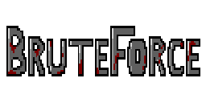
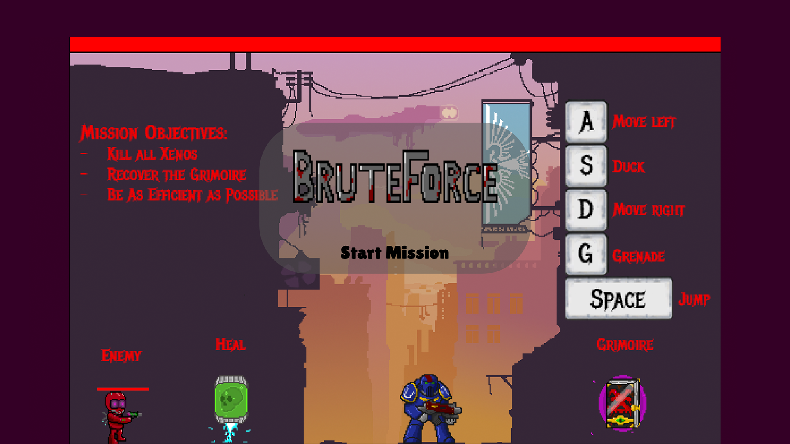
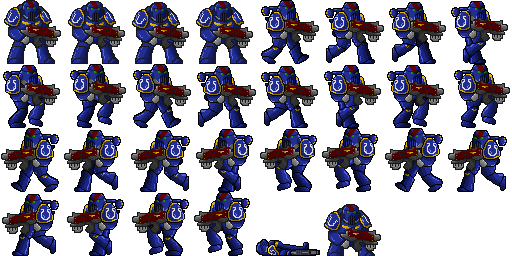
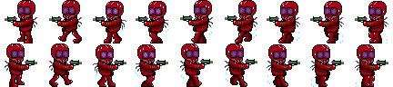

  # 🎮

 BruteForce is a 2D-Side-Scrolling Shoter Game set in the Warhammer40K Universe. You play as an Astartes Warrior that has to cleanse a hive mind and retrieve a old Grimoire. With your weapon (mouseclick), basic movement (ASD-keys) and a grenade (g-key) you have to be as efficient as possible to please the Emperor!

---

## 🌐 **Play the Game**
[Click here to play the game!](https://your-github-username.github.io/repository-name)

---

## 📸 **Screenshots**

### Gameplay:

  
  

---

### Menu and UI:

  
  
*Figure 2: Menu and user interface.*

---

## 🎨 **Spritesheets**
Below are the sprites used to create characters and objects in the game:

### Player Character:

  
  
*Figure 3: Player character animations.*

---

### Enemies and NPCs:

  
  
*Figure 4: Enemy animations.*

---

### The Grenade:

  
  
*Figure 4: Enemy animations.*

---

### The Grimoire:

  
  
*Figure 4: Enemy animations.*

---

### The Servitor-Head (Healing Item):

  
  
*Figure 4: Enemy animations.*

## ✍️ **Reflection**

### What went well:
- **Creative Design:** The theme and style came together seamlessly, and the sprites were fun to design.
- **Core Mechanics:** The gravity-based gameplay worked better than expected and provided a unique challenge.

### Challenges:
- **Time Constraints:** Implementing all the features we envisioned wasn’t possible due to the limited timeframe.
- **Bug Fixes:** Handling collisions and edge cases for gravity mechanics was tricky.

### Lessons Learned:
- **Prototyping Matters:** Testing early prototypes helped refine the core mechanics quickly.
- **Keep it Simple:** Focusing on one unique mechanic instead of multiple features made the game more polished.
