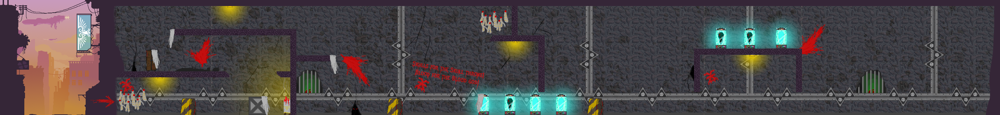
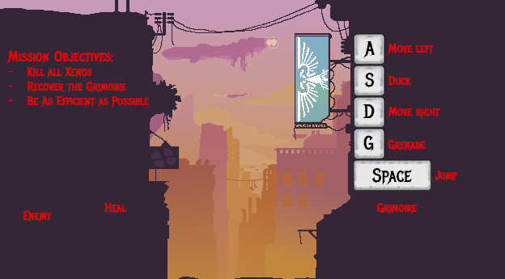

  # 🎮

 BruteForce is a 2D-Side-Scrolling Shoter Game set in the Warhammer40K Universe. You play as an Astartes Warrior who has to cleanse a hive mind on a xenos planet and retrieve an old Grimoire. With your weapon (mouseclick), basic movement (ASD-keys) and a grenade (g-key) you have to be as efficient as possible to please the God-Emperor!

---

## 🌐 **Play the Game**
[Click here to play the game!](https://timonschneider01.github.io/Brute/)

---

## 📸 **Screenshots**

### Gameplay:

  
  

---

### Menu and UI:

  
  
In the Menu i tried to depict everything the player needs to know: 
    There is a description of what to do in the top left:
    > Kill All Xenos
    > Recover the Grimoire
    > Be As Efficient as Possible
    

  
I also wanted to show all the Interactable Objects like the Enemies, the Healing Item and the Grimoire. Additionally the grenade and the bullets are interactable Objects as well

  
On the top right i showed the controlls of the game - Additionally the player uses the cursor to shoot bullets and aim where the grenade goes!

  
I also wanted to have a main menu where the player can move!

==========================================================================================

## 🎨 **Spritesheets**
Below are the sprites used to create characters and objects in the game:

### The Astartes ⚔️:

  
  
This is the Main Characters Spritesheet - i took inspiration from my miniatures and of course from all the Warhammer Content Online.

---

### Enemies 👾:

  
  
The EnemySpritesheet was completely original from me, trying to make them look like they come from the tanks that are placed in the level with blue liquid still coming out of there back-tubes.

    
    
This is what the Enemies look like when they die.

---

### The Grenade 💣:

  
  
With the Grenade Sprite i tried to create something that first implodes before it explodes. 

---

### The Grimoire 🔮:

  
  
The Grimoire the player has to retreive - lurking to be found and read to let chaos lose.

---

### The Healing-Item ❤️‍🩹:

  
  
The Healing Item is a Servitor Head inside of a breeding tank (not lore acurate) 

---

### **The Maps 🗺️**:

  
    
This is the whole level layout - Player has to go from left to right.

    
  
This is what the Main Menu looks like. I wanted the player to be able to move in the main menu so i created a smaller version of the main Map.

==========================================================================================

## ✍️ **Reflection**

### Achievments:
- **Time Management:** After the first two days of getting my head into the project and laying out everything i need to achieve in these days i was not stressed after all. I knew what i wanted to implement and what i need to do to achieve this. (Altough there might have been some All-nighters but just because it was fun)
  
- **Mathmatics/Physics in JS:**: It was satisfying to implement some things i have learned in the Mathematics and Physics Course. When i had to do the shooting on mouseclick i had to do some mathematical calculations in order for the player to shoot where he presses also because there is bulletdrop!

- **Game Graphics:** I was really satisfied with the game graphics i came up with:
  1) Spritesheets were definitely the biggest challenge. Making a walking animation was harder than anticipated but i was happy to create two rather nice ones!
  2) The Grenade: i wanted to create something that feels like it implodes first and then explodes and was happy it turned out just like that
  3) The Grimoire: I was happy with the design of the grimoire and the blinking and watching eye on the cover. Also i like the sparks that surround the book.
  4) The Heal: The heal is a floating head in a jar with green liquid and bubbles. i really liked how the animations turned out at the very end!
  5) The map: i started drawing the outside area of the map first. after that i was really satisfied with what it looked like only to realize this i like 1/10 of the whole thing. So i increased pace by a lot!
  6) All the drawings were made by me (except the dead enemy) - no AI was used to generate any form of graphics. 

### Challenges:
- **Compromizing:** due to the limited time of two weeks it was hard to decide which route i should go: more coding or more artwork? Once i finished everything i planned on doing (2 days before due date) i started working on more coding again (implementing grenade) only to realize i need to draw the explosion as well. Getting everything i want in there was the biggest challenge!
- **Bug Fixes:** Since i worked with the codebase from the 2D Browser Game Coding i started altering the Physics function early on (had to define physics for different Objects like the Player, the Bullets and Enemys) and was not able to use later versions - this lead to a lot of debugging and getting rid of glitches.
- **Amount of Code:** Since there were many things to implement and make work together, working on one piece of code only to toutch it a week later was hard and confusing at some points - but i made it work and was able to reintroduce myself to my code quickly. Also having more time would have lead to the code being more "clean" all the way through.

### Lessons Learned:
- **Planning:** I was really happy that i created a plan and a "backlog" right at the beginning so i had a checklist and developed a feeling for time early on! 
- **Inspiration:** Inspiration and Passion for a Project fuels me. I chose the Warhammer40k setting for this simple reason. I knew that if i worked on something i admire i will work on it hard!
- **Getting early feedback:** Asking my colleagues what they thought about my game and showing them what i got after one day was really helpfull to get feedback. Getting feedback right after completing said task helped me reflect on the task and not get overwhelmed by pride of being able to code this.
- **Using AI in Programming:** Of course it is needless to say that i also used AI when it came to programming. BUT there are two things i have learned from this:
  1) Using AI for Ideas is muuuuch better rather than just copying code. Letting ChatGPT push me into the right direction was definetly the way to go. Not asking for code directly but for an approach was my way to go after realizing that:
  2) You still need to understand what ChatGPT does. I spent some time to understand, decode and reverse-engineer whatever the LLM spat out because at the end of the day: you still need to understand what the AI did in order to implement it into your project. Which lead me to my first point again. Use AI to push my ideas rather than just letting it create my ideas in the first place! (Lesson definetly learned here)
